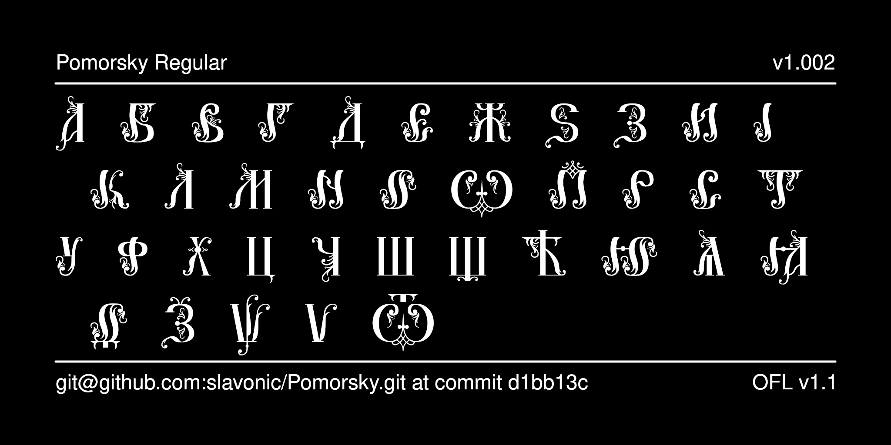

# Pomorsky Decorative Typeface

Pomorsky is a decorative font intended for drop caps (*bukvitsy*) and titling in Old Rite texts. It reproduces the calligraphic style of book and chapter titles used by Priestless Old Believers of the Vyg Hermitage.



## History

The font was designed by Nikita Simmons and then
reencoded for Unicode by Aleksandr Andreev as part of the
[Slavonic Computing Initiative](https://sci.ponomar.net/fonts.html), released under SIL OFL v. 1.1.

## License

This Font Software is licensed under the SIL Open Font License,
Version 1.1. This license is available with a FAQ at
[https://openfontlicense.org/](https://openfontlicense.org/).

## Building the Fonts

The font source is stored in a FontForge SFD file in the `sources/` directory. All modifications should be made in FontForge, resulting in an updated SFD file. This file is then converted to UFO format by running the convert script. From terminal:

```
cd your/local/project/directory
./convert.sh
```

The font can then be built using fontmake and gftools by running:

```
make build
```

Note that this requires Python and will install all of the necessary libraries and tools into a virtualenv at `venv/`.

To delete the virtualenv and the results of the build, run:

```
make clean
```

To build the sample image the sits at the top of this README, run:

```
make images
```

The commands `make update` and `make update-project-template` update the repository structure and Python dependencies and should be run periodically.

Google's master repository also had a GitHub workflow for building the fonts in the cloud on push, but this seems to always fail because of incorrect dependencies, so has been disabled. Instead, built binaries are stored on GitHub in the `fonts/` directory.

## Features

There are no specialized features. Only glyphs used in titling are provided in the font.

## More Church Slavonic Fonts

See the [main repository](https://github.com/typiconman/fonts-cu/issues) and the [website](https://sci.ponomar.net/fonts.html).
